# TuniStadium - Application Java

# TuniStadium Desktop 🏟️

## Aperçu du projet:
TuniStadium Desktop est une application Java robuste développée avec JavaFX pour la gestion des événements sportifs et culturels en Tunisie. Ce projet a été créé dans le cadre du cours PIDEV à **Esprit School of Engineering** pour offrir une solution complète de gestion des stades et événements.

Notre application de bureau permet aux administrateurs et au personnel de gérer efficacement les réservations d'événements, générer des billets avec QR codes, traiter les réclamations, analyser les statistiques de fréquentation, et communiquer avec les utilisateurs via SMS et email. Avec TuniStadium Desktop, nous offrons une solution professionnelle et performante pour la gestion administrative des stades tunisiens.

## Table des matières:
- [Fonctionnalités](#fonctionnalités)
- [Technologies utilisées](#technologies-utilisées)
- [Structure du projet](#structure-du-projet)
- [Installation](#installation)
- [Utilisation](#utilisation)
- [Modules](#modules)
  - [Gestion des utilisateurs](#gestion-des-utilisateurs)
  - [Gestion des réservations](#gestion-des-réservations)
  - [Gestion des événements](#gestion-des-événements)
  - [Gestion des réclamations](#gestion-des-réclamations)
  - [Gestion des publicités](#gestion-des-publicités)
  - [Gestion de la consommation](#gestion-de-la-consommation)
  - [Fonctionnalités transversales](#fonctionnalités-transversales)
- [API Documentation](#api-documentation)
- [Contribution](#contribution)
- [Licence](#licence)
- [Remerciements](#remerciements)

## Fonctionnalités:
TuniStadium Desktop offre une suite complète d'outils de gestion pour les administrateurs et le personnel:

- **Gestion d'événements** avec calendrier interactif
- **Gestion des réservations** avec génération de QR codes
- **Système de notifications** par SMS et email
- **Génération de rapports PDF** pour l'analyse des données
- **Tableau de bord statistique** pour suivre les performances
- **Système de filtrage et recherche avancée** pour tous les modules
- **Chatbot intégré** pour l'assistance aux utilisateurs
- **Système de localisation** pour la cartographie des stades
- **Interface administrateur** complète et intuitive

## Technologies utilisées:

### Plateforme de développement
- **Java 17** - Langage de programmation principal
- **JavaFX** - Framework d'interface utilisateur
- **Maven** - Gestionnaire de dépendances et build
- **IntelliJ IDEA** - IDE de développement

### Base de données
- **MySQL** - Système de gestion de base de données
- **JDBC** - API de connexion à la base de données

### Bibliothèques principales
- **JFoenix** - Composants Material Design pour JavaFX
- **ControlsFX** - Extensions pour JavaFX
- **iText** - Génération de documents PDF
- **Twilio SDK** - API d'envoi de SMS
- **JavaMail** - API d'envoi d'emails
- **ZXing** - Génération et lecture de QR codes
- **OpenStreetMap JMapViewer** - Cartographie et localisation
- **JFreeChart** - Visualisation statistique
- **Dialogflow** - Intégration de chatbot intelligent

## Structure du projet:
```bash
tunistadium-desktop/
├── src/
│   ├── main/
│   │   ├── java/
│   │   │   ├── com/tunistadium/
│   │   │   │   ├── controller/  # Contrôleurs JavaFX
│   │   │   │   ├── dao/         # Couche d'accès aux données
│   │   │   │   ├── entity/      # Classes modèles
│   │   │   │   ├── service/     # Services métier
│   │   │   │   ├── util/        # Classes utilitaires
│   │   │   │   └── Main.java    # Point d'entrée de l'application
│   │   ├── resources/
│   │   │   ├── assets/          # Images et ressources
│   │   │   ├── css/             # Fichiers de style
│   │   │   ├── fxml/            # Interfaces utilisateur FXML
│   │   │   └── config.properties # Configuration
│   ├── test/                     # Tests unitaires
├── pom.xml                       # Configuration Maven
└── README.md                     # Documentation


```
## Architecture visuelle:

```mermaid
graph TD
    A[TuniStadium Desktop] --> B[Controller]
    A --> C[DAO]
    A --> D[Entity]
    A --> E[Service]
    A --> F[Util]
    
    B --> B1[EventController]
    B --> B2[ReservationController]
    B --> B3[UserController]
    B --> B4[ReclamationController]
    B --> B5[ConsommationController]
    B --> B6[PubliciteController]
    
    C --> C1[MySQL JDBC]
    
    D --> D1[Modèles de données]
    
    E --> E1[EventService]
    E --> E2[ReservationService]
    E --> E3[UserService]
    E --> E4[ReclamationService]
    E --> E5[ConsommationService]
    E --> E6[PubliciteService]
    E --> E7[PDFService]
    E --> E8[StatisticsService]
    E --> E9[NotificationService]
    
    F --> F1[QRCodeGenerator]
    F --> F2[SMSUtil]
    F --> F3[EmailUtil]
    F --> F4[ChatbotUtil]
    F --> F5[MapUtil]
    F --> F6[FilterUtil]
    F --> F7[SearchUtil]
    
    classDef main fill:#f9f,stroke:#333,stroke-width:2px
    classDef module fill:#bbf,stroke:#333,stroke-width:1px
    class A main
    class B,C,D,E,F module

```


## Installation: 
  1. Clonez le repository :

```bash
git clone https://github.com/charfaaa/tunistade-desktop.git
cd tunistadium-desktop
```
2. Assurez-vous d'avoir installé :

JDK 17 ou supérieur
Maven 3.8 ou supérieur
IntelliJ IDEA (recommandé)


3. Importez le projet dans IntelliJ IDEA :

Ouvrez IntelliJ IDEA
Sélectionnez "Import Project"
Naviguez vers le dossier du projet et sélectionnez le fichier pom.xml
Suivez les instructions pour importer le projet Maven


4. Configurez la base de données :

Assurez-vous que MySQL est installé et en cours d'exécution
Créez une base de données nommée "tunistadium"
Modifiez le fichier src/main/resources/config.properties avec vos informations de connexion :
``` properties
db.url=jdbc:mysql://localhost:3306/tunistadium
db.user=votre_utilisateur
db.password=votre_mot_de_passe
```
5. Configurez les clés API :

Modifiez le fichier src/main/resources/config.properties avec vos clés API :
``` properties
twilio.account_sid=votre_sid_twilio
twilio.auth_token=votre_token_twilio
twilio.phone_number=votre_numero_twilio

mail.username=votre_email
mail.password=votre_mot_de_passe_email
mail.smtp.host=smtp.gmail.com
mail.smtp.port=587

dialogflow.project_id=votre_projet_dialogflow
```
6. Compilez et exécutez l'application :

Dans IntelliJ IDEA : Exécutez la classe Main.java
Ou via Maven :
``` bash
mvn clean javafx:run
```

  ## Utilisation:
 1. Lancez l'application via IntelliJ ou en utilisant la commande Maven
 2. Connectez-vous avec les identifiants administrateur par défaut :

    Nom d'utilisateur : admin
    Mot de passe : admin123


3. Explorez les différents modules de l'application via le menu principal

## Modules:

### Gestion des utilisateurs

Ce module permet de :

- Créer et gérer des comptes utilisateurs
- Gérer les rôles et les permissions
- Gérer les informations personnelles des utilisateurs
- Réinitialiser les mots de passe avec notification par email.
- Faire un abonnement 

### Gestion des réservations

Ce module permet de :

- Visualiser et gérer les réservations de billets
- Générer des QR codes pour les billets
- Vérifier la validité des billets par scan
- Gérer les places de parking réservées

### Gestion des événements

Ce module permet de :

- Créer et gérer des événements sportifs et culturels
- Planifier le calendrier des événements
- Visualiser l'occupation des stades
- Ajuster la place du match ou evenement qui va se passer

### Gestion des réclamations

Ce module permet de :

- Traiter les réclamations des utilisateurs
- Assigner des réclamations au personnel concerné
- Suivre l'état de résolution des problèmes
- Générer des rapports statistiques sur les types de réclamations
- Demander au chatbot de vous aider 

### Gestion des publicités

Ce module permet de :

- Gérer les contrats publicitaires
- Planifier les campagnes publicitaires
- Suivre les performances des publicités
- Générer des factures pour les annonceurs

### Gestion de la consommation

Ce module permet de :

- Gérer l'inventaire des produits alimentaires
- Traiter les commandes de nourriture et boissons
- Suivre les livraisons aux sièges
- Analyser les tendances de consommation

## Fonctionnalités transversales: 

### Génération de PDF : 
- Création la liste des utilisateurs au format PDF
### Recherche et filtrage : 
- Système avancé pour retrouver rapidement les informations
### Statistiques : 
- Visualisation des données clés avec graphiques interactifs
### Notifications : 
- Envoi automatique de SMS et emails aux utilisateurs
### Chatbot : 
- Assistant virtuel pour guider les utilisateurs dans leurs tâches
### Localisation : 
- Cartographie des stades et événements

## API Documentation:

Notre application intègre plusieurs APIs et bibliothèques externes :

### Twilio - Service de messagerie SMS
- **Utilisé pour:** Notifications aux utilisateurs
- **Classe principale:** SMSUtil
- [Documentation Twilio](https://www.twilio.com/docs)

### JavaMail - Service d'emails
- **Utilisé pour:** Notifications email et récupération de mot de passe
- **Classe principale:** EmailUtil
- [Documentation JavaMail](https://javaee.github.io/javamail/)

### ZXing - Génération de QR codes
- **Utilisé pour:** Billets électroniques avec QR codes
- **Classe principale:** QRCodeGenerator
- [Documentation ZXing](https://github.com/zxing/zxing/wiki/Getting-Started-Developing)

### iText - Création de PDF
- **Utilisé pour:** Génération de rapports et documents
- **Classe principale:** PDFService
- [Documentation iText](https://itextpdf.com/en/resources/api-documentation)

### OpenStreetMap JMapViewer - Cartographie
- **Utilisé pour:** Localisation des stades et planification
- **Classe principale:** MapUtil
- [Documentation JMapViewer](https://wiki.openstreetmap.org/wiki/JMapViewer)

### Dialogflow - Assistant virtuel
- **Utilisé pour:** Chatbot d'assistance
- **Classe principale:** ChatbotUtil
- [Documentation Dialogflow](https://cloud.google.com/dialogflow/docs)

### JFreeChart - Visualisation de données
- **Utilisé pour:** Graphiques et statistiques
- **Classe principale:** StatisticsService
- [Documentation JFreeChart](https://www.jfree.org/jfreechart/javadoc/index.html)

## Contribution
Nous sommes ouverts aux contributions ! Si vous souhaitez contribuer à ce projet :

1. Forkez le repository
2. Créez une branche pour votre fonctionnalité (git checkout -b feature/ma-fonctionnalite)
3. Committez vos changements (git commit -m 'Ajout de ma fonctionnalité')
4. Poussez vers la branche (git push origin feature/ma-fonctionnalite)
5. Ouvrez une Pull Request

### Standards de code
- Respectez les conventions de nommage Java
- Documentez votre code avec Javadoc
- Écrivez des tests unitaires pour les nouvelles fonctionnalités
- Suivez le modèle MVC (Modèle-Vue-Contrôleur)

## Licence
Ce projet est sous licence MIT. Voir le fichier LICENSE pour plus d'informations.

## Remerciements
Ce projet a été développé sous la supervision de Mme Maroua Belkneni à Esprit School of Engineering. Nous tenons à remercier tous les membres de l'équipe pour leur contribution à ce projet :

* **Zeineb Ghezaiel** - Gestion des utilisateurs - [Zeineb.Ghezaiel@esprit.tn]
* **Oumaima Mahmoud** - Gestion des réservations - [Oumaima.Mahmoud@esprit.tn]
* **Taieb Bsaies** - Gestion des événements - [Taieb.Bsaies@esprit.tn]
* **Mohamed Aziz Cherif** - Gestion des réclamations - [Mohamedaziz.Cherif.1@esprit.tn]
* **Mohamed Skander Ghannem** - Gestion des publicités - [Mohamedskander.Ghannem@esprit.tn]
* **Nadine Razki** - Gestion de la consommation - [Nadine.Razki@esprit.tn]
